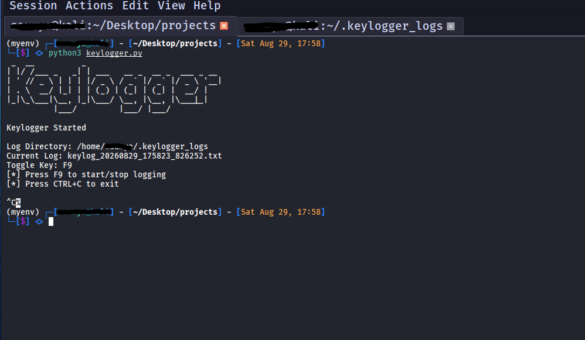
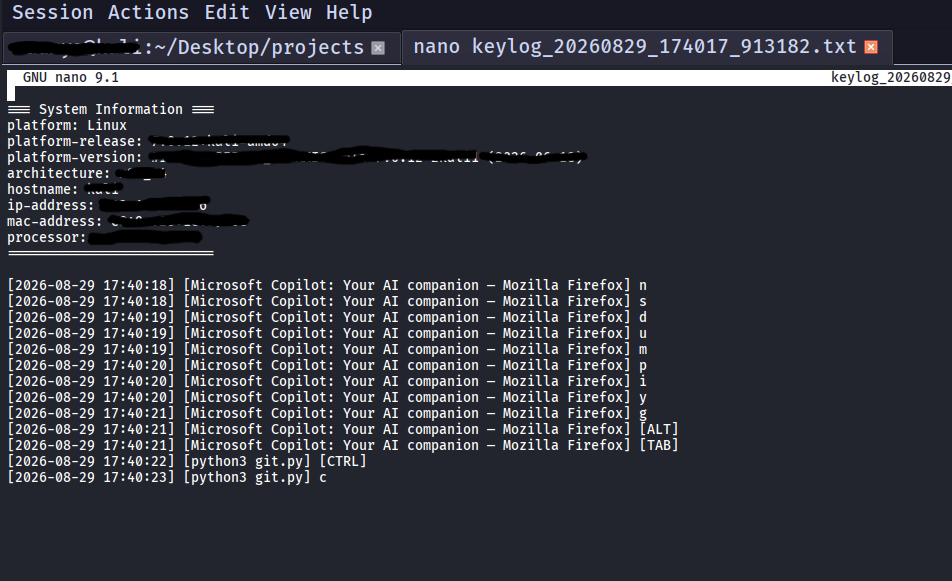
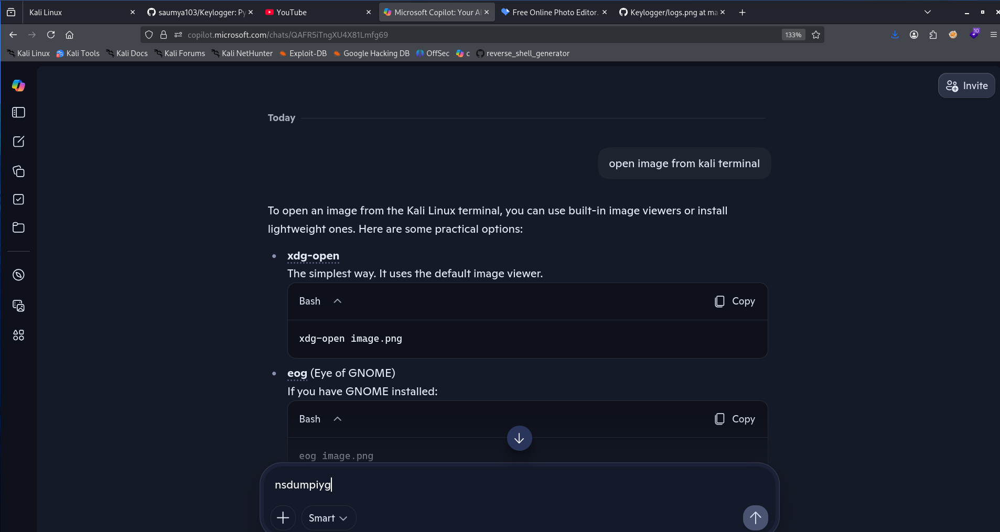

# Keylogger 

Python-based keylogger and system monitoring utility with Telegram Bot integration for remote management. It captures keystrokes, tracks active window titles, captures screenshots, gathers system hardware/network information, and streams logged data back to a specified Telegram bot.

# Features:
-  Real-time Key Capture: Logs both alphanumeric characters and special functional keys (e.g., [ENTER], [SPACE], [SHIFT], [CTRL], [ALT]).

-  Supports Linux (xdotool), Windows (win32gui), and macOS (AppKit).

  
-  Automatically captures initial screenshots upon script launch.

-  Gathers OS release/version, CPU architecture, hostname, and processor info.

-  Retrieves both local IP, MAC address.

-  Prevents oversized log files by automatically rotating to a new .txt file when reaching the 5 MB size limit.

-  Stores logs cleanly inside the user's home directory (~/.keylogger_logs/).

-  Keylogger runs on a background daemon thread while the Telegram bot operates on the main thread without blocking performance.

# 

# Workflow:

## 1. Bot Token Setup: 
  The script uses python-telegram-bot (telegram.ext.Application) with your configured token (BOT_TOKEN = "...").

## 2. Available Telegram Commands: 
  Once the script runs, open Telegram, message your bot, and use any of these commands:

  - /start or /help: Lists all available commands and usage.
  - /sendlogs: Sends all captured keylog .txt files from ~/.keylogger_logs/ as documents.
  - /screenshots: Sends all saved screenshot .png images from ~/.keylogger_logs/ as photos.
  - /take_screenshot: Instantly captures a live screenshot of the active screen and sends it immediately to your Telegram chat.
  - /all: Sends both keylog text files and screenshots in sequence.
  - /info: Sends full system details (LAN/Global IP, OS, Architecture, Hostname).
    
## 3.Built-in Protections:

 - Skips empty files to prevent BadRequest: File is empty API crashes.
 - Includes exception handling per file so one failed file doesn't block the rest.
 - Uses send_photo for images (.png) and send_document for keylog files (.txt)
